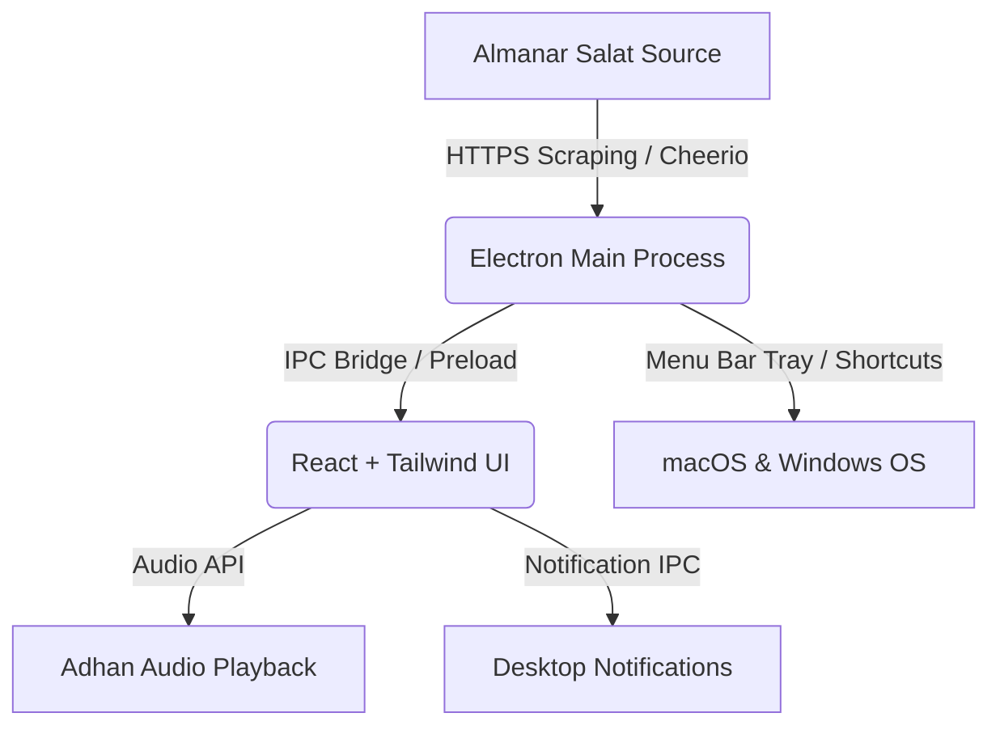

<div align="center">

# 🕌 SalatWidget (Prayer Widget)

### Modern, Frameless & Transparent Islamic Prayer Times Desktop Widget

An elegant, glassmorphic desktop widget for **macOS** and **Windows 11**.  
Built with **Electron**, **React**, and **Tailwind CSS**.

[](https://github.com/Hasanakramprog/SalatWidget)
[](https://www.electronjs.org/)
[](https://reactjs.org/)
[](https://tailwindcss.com/)
[](LICENSE)

<br />

[Features](#-key-features) • [Platform Support](#-platform-support) • [Installation](#-quick-start) • [Shortcuts](#-shortcuts--controls) • [Building](#-building-for-production)

</div>

---

## ✨ Key Features

- **📡 Live Data Scraping**: Automatically fetches up-to-date prayer times directly from [Almanar](https://almanar.com.lb/salat/) with automatic offline caching fallback.
- **🪟 Native macOS & Windows 11 Experience**: Frameless glassmorphic widget designed with subtle blurs, backdrop filters, and delicate borders.
- **🖥️ Multi-Space & Desktop Spaces**: Configured to stay visible across macOS virtual desktops (Spaces) when swiping.
- **📌 Always on Top (Pin)**: Float above other active windows or keep it settled unobtrusively on your desktop.
- **🧭 System Tray & Menu Bar Support**: Full menu bar tray integration on macOS and Windows for quick actions without cluttering the Dock/Taskbar.
- **🖱️ Draggable Anywhere**: Click and drag anywhere on the widget to reposition it seamlessly.
- **⚡ Next Prayer Highlight & Live Countdown**: Automatically highlights upcoming prayers with a subtle breathing glow and provides a real-time countdown timer.
- **🔊 Adhan Audio & Desktop Notifications**: Plays the Adhan at the exact prayer time and delivers desktop notifications (with one-click mute).
- **🚀 Auto-Start at Login**: Silently starts in the background when your computer boots up.
- **✒️ Premium Arabic Typography**: High-DPI Arabic fonts (`Amiri` and `Geeza Pro`) tailored for Retina and high-resolution displays.

---

## 💻 Platform Support

| Feature | macOS (Apple Silicon & Intel) | Windows 11 / 10 |
| :--- | :---: | :---: |
| **Frameless Glassmorphic UI** | ✅ | ✅ |
| **Menu Bar / System Tray Item** | ✅ (macOS Menu Bar) | ✅ (System Tray) |
| **Virtual Desktops (Spaces)** | ✅ (`setVisibleOnAllWorkspaces`) | ✅ |
| **Dock / Taskbar Suppression** | ✅ (`app.dock.hide`) | ✅ (`skipTaskbar`) |
| **Global Show/Hide Shortcut** | ✅ (`Shift + S`) | ✅ (`Shift + S`) |
| **Adhan Audio & Notification** | ✅ | ✅ |
| **Start on Login** | ✅ (`openAsHidden`) | ✅ |

---

## ⌨️ Shortcuts & Controls

| Action | Control / Shortcut | Description |
| :--- | :---: | :--- |
| **Show / Hide Widget** | `Shift + S` | Global toggle from anywhere in the OS |
| **Right-Click Context Menu** | `Right-Click Widget` | Toggle Pin, Mute Sound, Refresh Times, or Quit |
| **Pin on Top** | Pin Icon (Header) | Toggles floating mode above all windows |
| **Mute / Unmute** | Speaker Icon (Header) | Toggles Adhan audio playback |
| **Hide Widget** | Close (`×`) Icon | Hides the widget to the menu bar / tray |
| **Dismiss Adhan Audio** | `Escape` | Immediately stops playing the current Adhan |
| **Quit App** | `Cmd + Q` (Mac) / `Ctrl + Q` (Win) | Exits the application |

---

## 🚀 Quick Start

### Prerequisites
- **Node.js** (v18 or higher recommended)
- **npm** or **yarn**

### 1. Clone the repository
```bash
git clone https://github.com/Hasanakramprog/SalatWidget.git
cd SalatWidget
```

### 2. Install dependencies
```bash
npm install
```

### 3. Start the application
```bash
npm run start
```
> This command builds the frontend bundle with Vite and launches the Electron application.

---

## 📦 Building for Production

Create standalone executables and distribution packages:

### macOS (.dmg & .zip)
Build native packages for Apple Silicon and Intel:
```bash
npm run dist:mac
```
Output will be generated in `release/`:
- `release/Prayer Widget-1.0.0-arm64.dmg`
- `release/Prayer Widget-1.0.0-arm64-mac.zip`

### Windows (.exe installer)
Build an NSIS installer for Windows:
```bash
npm run dist:win
```
Output:
- `release/Prayer Widget Setup 1.0.0.exe`

---

## 🛠️ Architecture & Tech Stack



- **Runtime:** [Electron](https://www.electronjs.org/)
- **Frontend:** [React 18](https://react.dev/) + [Vite](https://vitejs.dev/)
- **Styling:** [Tailwind CSS](https://tailwindcss.com/)
- **Scraper:** [Cheerio](https://cheerio.js.org/)
- **Packager:** [Electron Builder](https://www.electron.build/)

---

## 📄 License

This project is licensed under the **MIT License** - see the [LICENSE](LICENSE) file for details.
